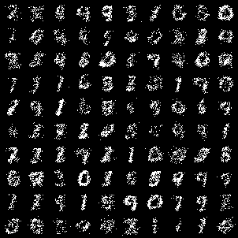
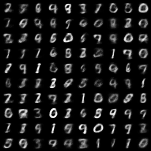

# Deep-Generative-Models
VAEs and GANs for MNIST(UvA 2019 Deep Learning course Assignment)

This repository contains PyTorch implementations of Variational Auto Encoders and Generative Adversarial Networks and a report comparing their results and attributes based on MNIST data.

General questions regarding the topic and the models can be found in the [assignment PDF](_assignment_questions.pdf). Insights and results can be found in the [report](_report_answers.pdf).

# Results

## VAEs

Evenly sampled VAE results across 40 epochs, showing Bernoulli sample (left) and means (right). Latent space is 20 dimensional.

 

## GANs

Evenly sampled GAN results across 150 epochs.

- Interpolation between digits

### Acknowledgement

The code may bear resemblance to others, as these were assignments from the *2019 Deep Learning Course* at the University of Amsterdam (UvA), as a part of Aritificial Intelligence MSc program.
Template empty class codes were provided and we were tasked implement architectures, working training, and any other additional functionality we may have needed.
